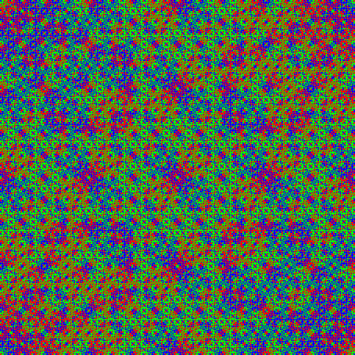

# T-fractal

A small web app to create fractals by layering a simple seed pattern at different scales.

---

## How It Works

You start with a small pattern called a seed - like a 4×4 grid of 0s and 1s.

This seed is repeated to fill the entire 2D matrix.

Then we make the seed bigger (twice as big), and fill the matrix again - but instead of clearing it, we accumulate the new values with the existing ones.

We keep doing this: make the seed bigger, fill again, and accumulate again.

In the end, each cell in the matrix contains a number showing how many times it was hit with a 1.

Then we color the result - using grayscale, rainbow, or CGA palettes - based on the final number in each cell.

---

[Demo](http://xcont.com/tfractal/)

[Demo 3D](https://xcont.com/tfractal/3d.html)

---

## License

MIT License. See [LICENSE](LICENSE) for details.

---

## Author

Serhii Herasymov  

sergeygerasimofff@gmail.com  

https://github.com/xcontcom

---
